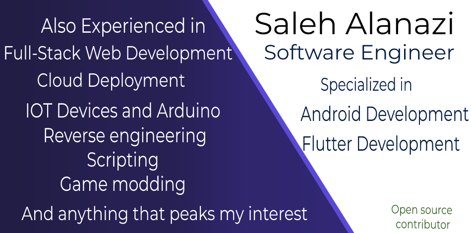

# Welcome to My Github page. 

- 🔭 I’m currently working on: Native Android Applications
- 🌱 I’m currently learning: Honsetly everything... From Software engineering patterns to Reverse engineering - New Web/ Mobile technologies 
- 📚 I'm currently reading:  Practical Object-Oriented Design An Agile Primer Using Ruby -  by Sandi Metz
- 💬 Ask me about: Native Android Development or The Android architecture. Flutter Development, Android Reverse engineering, Backend development
- 📫 How to reach me: ... I read emails, or Twitter DMs

<b>⚡ My GitHub Statistics</b>  

 

  

 
   

